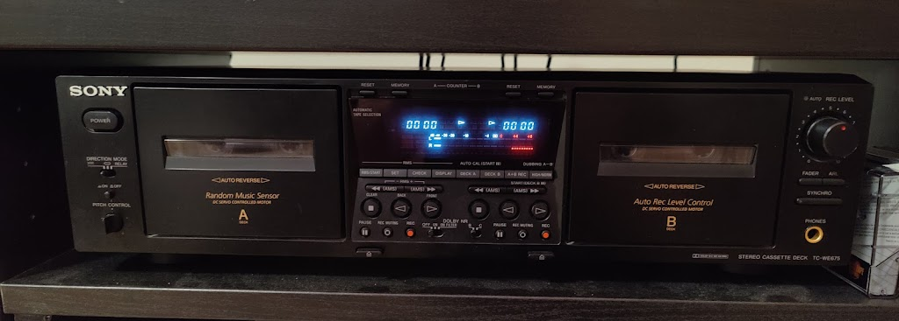
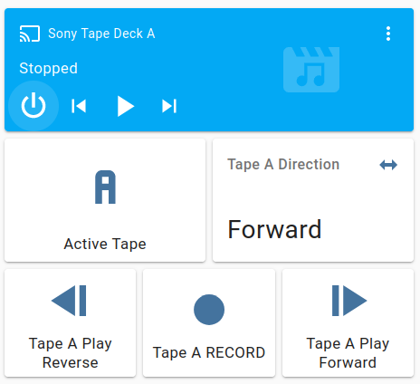

An ESPHome based Home Assistant integration for controlling a Sony TC-WE675 Tape deck over its A1 Control serial port.

* /esphome - esphome configuration
* /homeassistant - sample HACS/media_player_template entity and lovelace cards
* /util - code timing conversion utilities
* /pcb - EagleCAD files for hardware build
* /enclosure - OpenSCAD and STL files for 3D printing enclosure

