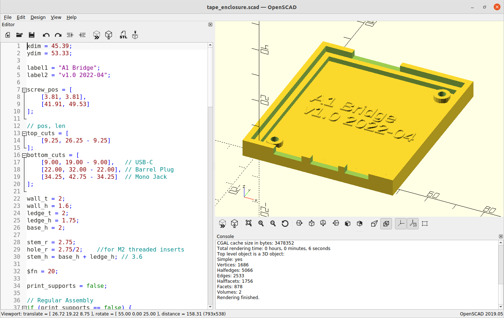

OpenSCAD source files and rendered STLs for printable PCB enclosure.

Designed to use M2 x 3.5mm threaded brass inserts

## Print Settings

* Supports: no
* Infill: 100% where tape_enclosure and tape_enclosure_supports overlap, 20% everywhere else
* Material: any

