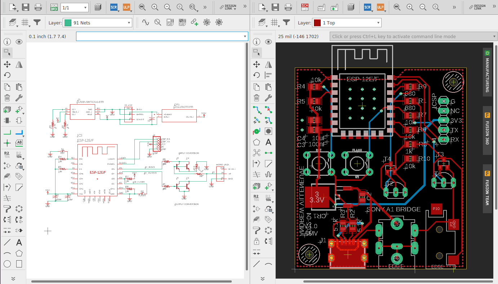

Board and schematic files for EagleCAD

## BOM

| Part                    | Description            | Qty  | Link                                                         |
| ----------------------- | ---------------------- | ---- | ------------------------------------------------------------ |
| KUSBX-SMT-CS-6-BTR      | 6-pin USB-C power port | 1    | https://www.digikey.com/en/products/detail/kycon-inc/KUSBX-SMT-CS-6-BTR/13545035 |
| ...Or
| PJ-082BH                | 5mm DC barrel blug     | 1    | https://www.digikey.com/en/products/detail/cui-devices/PJ-082BH/3477156 |
| MJ-3523-SMT-TR          | 3.5mm mono jack        | 1    | https://www.digikey.com/en/products/detail/cui-devices/MJ-3523-SMT-TR/281296 |
| MMBT2222A-G             | SOT-23 NPN BJT         | 2    | https://www.digikey.com/en/products/detail/comchip-technology/MMBT2222A-G/3300110 |
| ...Or
| 2N2222                  | TO-92 NPN BTJ          | 2    |                                                              |
| TS02-66-60-BK-100-LCR-D | Tactile switch         | 2    | https://www.digikey.com/en/products/detail/cui-devices/TS02-66-60-BK-100-LCR-D/15634327 |
|                         | 0805 100nF Capacitor   | 2    |                                                              |
|                         | 0805 10k Resistor      | 5    |                                                              |
|                         | 0805 10uF Capacitor    | 1    |                                                              |
|                         | 0805 1k Resistor       | 1    |                                                              |
|                         | 0805 5.1k Resistor     | 2    |                                                              |
|                         | 0805 680 ohm Resistor  | 2    |                                                              |
| ESP8266-12F             | ESP Module             | 1    | https://www.amazon.com/gp/product/B089PTN2V5/                |
| LD1117ADT33TR           | 3.3V Linear Regulator  | 1    | https://www.digikey.com/en/products/detail/stmicroelectronics/LD1117ADT33TR/669253 |
|                         | 5x2.54mm header        | 1    |                                                              |